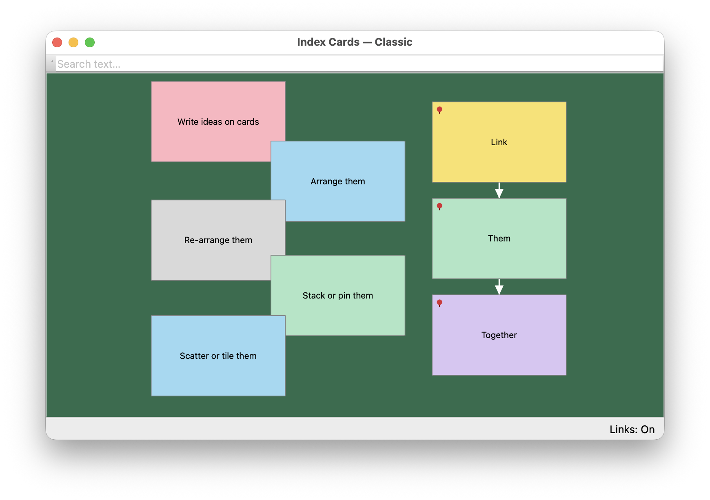

# IndexCards

[](LICENSE.md)



## Overview

When I'm tackling a complex project, I will often write a bunch of discrete ideas on index cards, then arrange and rearrange them on my kitchen table. This application is my attempt to port that process to a screen. I'm not sure yet whether a virtual set of cards can actually provide the same benefits as the real thing, but I thought it would be an interesting hypothesis to test.

### Features

* **Cards and Stacks** — jot ideas onto freeform cards, drag them anywhere on the canvas, and group related ones into stacks
* **Links** — draw connections between cards to show relationships, with adjustable line endings, colors, and weight
* **Auto-arrange tools** — tidy up with one click: tile, scatter, align, distribute, gather stacks, or untangle a tangled web of linked cards
* **Visual themes** — four built-in palettes (including a high-contrast accessible one), or build and edit your own custom theme
* **Adaptive text** — card text automatically shrinks to fit as needed, so nothing runs off the edge
* **Search** — filter the whole board by text as you type, on the canvas or in the list view
* **List view** — see every card as rows in a sortable table, kept in sync with the canvas
* **Undo/redo** — every action is undoable, including bulk arranges and theme changes
* **Cut/copy/paste** — move cards between boards, or export/import as plain text to and from other apps
* **Accessibility** — WCAG-checked color themes, plus automatic contrast for text and selection outlines
* **Open file format** — documents are plain, documented JSON (`.idxcards`), designed to be read and edited by hand or by an AI agent without ever opening the app

## Installation

Since this project is still in its early days I haven't packaged it into a discrete installer, so to run it you'll have to get your hands (ever so slightly) dirty, by cloning the repo and maybe installing a tool.

### MacOS

The easiest way to run IndexCards is straight from source, using [uv](https://docs.astral.sh/uv/) to manage Python and all the dependencies for you.

1. Install `uv`, if you don't already have it:

   ```bash
   brew install uv
   ```

   (or see [the uv install docs](https://docs.astral.sh/uv/getting-started/installation/) for other options)

2. Clone this repo and run the app:

   ```bash
   git clone https://github.com/nballenger/IndexCardsApp.git
   cd IndexCardsApp
   uv run indexcards
   ```

If you'd rather have a normal double-clickable app instead of running it from a terminal every time, you can build one yourself:

```bash
uv run pyinstaller IndexCards.spec --noconfirm
open dist/IndexCards.app
```

That produces `dist/IndexCards.app`, which you can drag into `/Applications` or leave wherever's convenient. Since it isn't signed with an Apple Developer account, macOS will warn that it's from an "unidentified developer" the first time you open it — right-click the app and choose **Open** to get past that; you'll only need to do it once.

### Linux

If you clone the repo and install `uv`, you should be able to run the app. It's all Python Qt under the hood, so there's nothing Mac specific about it.

## Design / Development Considerations

This sort of application (a management interface for a bunch of small, related chunks of text) is incredibly vulnerable to scope creep and feature inflation. Lose focus for a few minutes as a developer and your elegant little thought collector metastasizes into a bad RDBMS with a built in micro-blogging client. That being the case, I'd like to lay out some of the constraints / intentions I'm trying to keep to in building this thing:

1. **The card metaphor is not to be broken.** - You can only put as much text on a card as will fit on the front face. There's a little wiggle room there, since on a real card you can write very small if you want to, and I want to respect that kind of choice. So the app might shrink a card's font a little, muck about with the padding a tiny bit, etc., but there must ultimately be a hard limit to what you can fit on a card.
2. **Visual styling options should be minimal and opinionated.** - I am purposely placing limits on how much the user can control the look of the application. It's a tool for exploring ideas, not making presentations. That said, I do want it to be accessible and generally pleasant to have on one's screen.
3. **Features without a physical analog should be very carefully considered.** - Let's take tagging as an example. In the very first draft of the application, I added the ability to arbitrarily tag cards. It just seemed like an obvious thing to do: they're little objects, they're on a computer, they should be taggable! Why though? What does it add? As far as I can tell, mostly just noise. So I removed the tags, and instead allow the user to set labels on the colors cards can be.
4. **The app's documents should be open format, and human-readable.** - They have their own extension (`.idxcards`), but they're just JSON under the hood. That's the open format part. "Human-readable" is a little hazier, because what the document describes is a visual arrangement of objects, potentially linked into one or more graph structures. Those aspects are pretty hard for a human to visualize correctly from a serialized source. So I guess I mean it's human-readable in that it's not a binary format, and it's somewhat self-annotating? Anyway, if the document was completely intelligible to a human, there'd be no point to the app itself. I'm trying to be a good digital citizen here, is probably my real point.
5. **It's not a webapp.** - Your kitchen table isn't backed by a web service, and neither is this.
6. **It doesn't have AI, but feel free to bring your own.** - I can't imagine a good reason for the application itself to have AI built directly into it. That said, if you want to have an AI tool drive it, be my guest. I've tried my best to make the documents their own self-contained units of meaning, so you _should_ be able to give one to an AI agent and have it reason well about the content. Additionally there is a CLI linter built into the app, so an external agent can create and validate new `.idxcards` files without having to open the GUI application. 
7. **It's free.** - I don't have the inclination (or the patience) to make this a commercial product, so consider it a gift from me to you. I like making things, and it would make me pretty happy to know if you get some use out of this, or if you have thoughts about how to make it better. Also if you want to buy me a coffee you totally can, and I'd be happy about that too.

### Disclosure about AI

I want to be transparent about the fact that I've used AI tools to build this application. I'm generally very skeptical of AI, and I feel actively hostile towards the corporate entities building and promoting it. However, I do want to have a sense of what it's like as a tool for software development, if for no other reason than to know what my colleagues may be getting up to. This application has been my test case for working with Anthropic's Claude Code tool. It's been very interesting to use, and maybe at some point I'll write up what I've learned in the process. If you find yourself interested in the development progression of the project, please feel free to read over the commits. My prompting isn't in there, but Claude's pretty chatty so I'm sure there's lots to take in.
